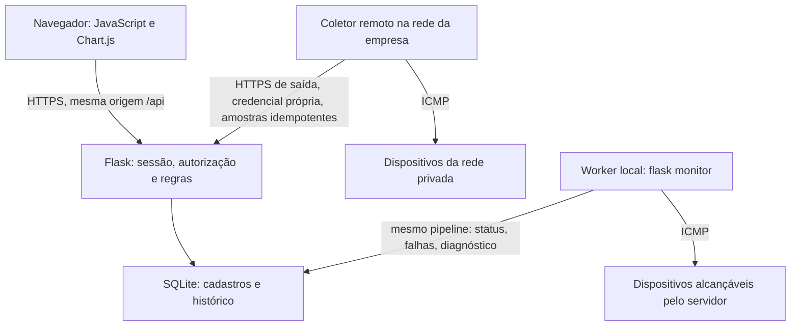

# EdgeHealth

Monitoramento e diagnóstico lógico de redes para pequenas e médias empresas. Inventário por empresa, amostras ICMP históricas, ocorrências com ciclo de vida, impacto, diagnóstico por regras, recomendações, dashboard e exportação CSV.

A implementação oficial está em `backend/` e `frontend/`. As cópias divergentes foram consolidadas; o histórico anterior permanece no Git. Não há seed de usuários, dispositivos, métricas ou falhas no produto.

**Validação de 06/10/2026** (Windows 11, Python 3.12.10, Node 22):

- Backend: 46 testes aprovados; os 2 testes opcionais de rede real foram pulados na suíte padrão.
- Frontend: 16 testes aprovados e build concluído.
- ICMP real: aprovado nesta máquina em loopback e no gateway da LAN de teste, inclusive pelo coletor remoto enviando por HTTP.

Isso foi homologado em laboratório, não na rede de uma empresa cliente, e a aplicação **não está hospedada**. Detalhes em [o checkpoint](docs/IMPLEMENTATION_STATUS.md), [a revisão](docs/POST_IMPLEMENTATION_REVIEW.md), [a hospedagem](docs/DEPLOY.md), [a privacidade](docs/LGPD.md) e [a demonstração](docs/DEMO.md).

## Arquitetura



Backend: Flask, SQLAlchemy e Flask-Migrate/Alembic. Frontend: JavaScript em módulos ES, Vite e Chart.js. Coletor: Python, com biblioteca padrão e icmplib. SQLite é o banco validado para uma instância (ver [DEPLOY.md](docs/DEPLOY.md)).

### API em camadas

Toda funcionalidade segue o mesmo fluxo:

```text
Tela → API Flask → Controller → Service → Model / Repository → Banco
```

```text
backend/
├── app/                  infraestrutura do Flask (sem regra de negócio)
│   ├── __init__.py       create_app: configuração, banco, blueprint, erros e cabeçalhos
│   ├── config.py         variáveis de ambiente
│   ├── extensions.py     SQLAlchemy e Flask-Migrate
│   ├── security.py       decorators require_auth / require_collector e cookies de sessão
│   ├── validation.py     validação de campos (funções puras, usadas pelos services)
│   └── cli.py            comandos flask (monitor, probe, backup, purge-history...)
├── controllers/          uma classe por recurso + rotas.py (Blueprint 'api')
├── services/             uma classe por caso de uso, método executar(), por recurso
│   ├── autenticacao/  empresas/  usuarios/  dispositivos/  metricas/  falhas/
│   ├── diagnosticos/  dashboard/  relatorios/  coletores/  coletor_api/
│   ├── monitoramento/    sonda ICMP, classificação de status, registro de medição, lease
│   ├── custos/           cálculo do prejuízo estimado (expediente, grupo compartilhado)
│   ├── privacidade/  legado/  saude/
│   └── comum/            serialização JSON das entidades e hash de credenciais
├── models/               um arquivo por entidade; base.py com o CRUD comum
├── repositories/         consultas especiais (SQL) e controle de transação
├── migrations/           Alembic
└── tests/
```

| Camada | Papel | Não pode |
| --- | --- | --- |
| **Controller** (`controllers/`) | Recebe a requisição HTTP, lê o JSON, a query string e o usuário autenticado, chama o service e devolve a resposta (status e JSON). `rotas.py` liga cada URL e método HTTP a um método de controller, com a autenticação exigida. | Ter regra de negócio ou acessar o banco (`sqlalchemy`/`db`). |
| **Service** (`services/`) | Um caso de uso por classe (`CadastrarDispositivoService`, `RegistrarImpactoService`, `ReceberAmostrasService`...). Valida os dados, aplica as regras e coordena models, repositories e a transação. As regras de domínio também são classes: `RegistrarMedicaoService` (status e ciclo das ocorrências), `AnalisarFalhaService` e `CalcularSeveridadeService` (diagnóstico), `CalculadoraPrejuizo` (custos) e `SondaIcmpService` (integração ICMP). Recebe usuário e empresa como parâmetros. | Ler `flask.request`/`flask.g` ou executar SQL. |
| **Model** (`models/`) | Mapeamento de cada tabela. Todos herdam `BaseModel`, com `salvar()`, `atualizar()`, `deletar()`, `listar_todos()` e `buscar_por_id()` (`commit=False` mantém a operação na transação do caso de uso). | Conter consultas especiais ou regras de caso de uso. |
| **Repository** (`repositories/`) | Somente consultas especiais: busca limitada à empresa (multiempresa), histórico de falhas com filtros e paginação, métricas por período, agregações do dashboard e ranking de custo (SQL com `text()`), dados do relatório (JOIN e períodos sobrepostos), dispositivos devidos para coleta, lease do dispositivo e grupo de falhas compartilhadas. `Transacao` confirma ou desfaz a transação. | Repetir o CRUD dos models. |

`tests/test_architecture.py` falha se um controller importar `sqlalchemy`/`db`, se um service usar `flask.request`/`flask.g` ou SQL, ou se faltar uma das cinco operações de CRUD na classe base dos models.

**Rede privada:** um servidor hospedado na Internet não alcança `192.168.x.x` da empresa. Cada dispositivo tem uma **origem da medição**:

- **worker local**, para o que o próprio servidor alcança;
- **coletor remoto** instalado na rede da empresa ([collector/README.md](collector/README.md)).

O coletor só mede e envia. Status, ocorrências, severidade e diagnóstico são sempre calculados no servidor, pelo mesmo `RegistrarMedicaoService` usado pelo worker. O worker nunca mede um dispositivo atribuído a um coletor.

## Pré-requisitos

- Python 3.12 ou superior; validado em Python 3.12.14/Linux.
- Node.js 22.12 ou superior compatível com Vite 8, e npm.
- Acesso à LAN dos dispositivos e permissão do sistema operacional para ICMP.
- Navegador atual.

## Instalação do backend

Na raiz do repositório, em Linux/macOS:

```bash
cd backend
python3 -m venv .venv
source .venv/bin/activate
python -m pip install -r requirements-dev.lock
cp -n .env.example .env
```

Windows/PowerShell:

```powershell
cd backend
py -3 -m venv .venv
.venv\Scripts\Activate.ps1
python -m pip install -r requirements-dev.lock
if (!(Test-Path .env)) { Copy-Item .env.example .env }
```

O lock inclui runtime e ferramentas de teste do ambiente validado. `requirements.txt` contém as dependências diretas de runtime; `requirements-dev.txt`, os extras de desenvolvimento. Preserve um `.env` existente e revise seu banco antes de prosseguir.

## Banco novo e migrations

**Se já existe um banco do protótipo, siga [a importação legada](docs/LEGACY.md) antes de aplicar migrations.** A migration inicial não deve ser aplicada sobre tabelas antigas de mesmo nome. Não use `db stamp` para contornar incompatibilidade de schema.

Dentro de `backend/`, com o ambiente virtual ativo:

```bash
python -m flask --app run.py db upgrade
python -m flask --app run.py seed-catalog
python -m flask --app run.py db current
python -m flask --app run.py db check
```

`DATABASE_URL=sqlite:///edgehealth.db` resolve para `backend/instance/edgehealth.db`. Para caminho absoluto Linux, use quatro barras: `sqlite:////caminho/edgehealth.db`. API e worker devem usar o mesmo banco. O seed cria somente oito ações corretivas e é idempotente.

- `55463d3f0b18`: entidades, sessões, FKs, constraints, índices históricos, IP ativo único por empresa e uma falha aberta por dispositivo.
- `7c7ba005affc`: preservação separada dos registros legados, sem tratá-los como medições reais.

Há integridade referencial SQLite em cada conexão e espera limitada para bloqueio de escrita. Dispositivos são arquivados; seu histórico permanece. API e worker não executam `create_all()` na inicialização.

## Executar em desenvolvimento

Terminal 1, dentro de `backend/`, com o ambiente virtual ativo:

```bash
python run.py
```

Terminal 2, também em `backend/`, com o mesmo ambiente virtual:

```bash
python -m flask --app run.py monitor
```

Terminal 3, a partir da raiz do repositório:

```bash
cd frontend
npm ci
npm run dev
```

Abra `http://localhost:5173`. Vite encaminha `/api` para `http://127.0.0.1:5000`; `API_PROXY_TARGET` ajusta esse destino quando necessário. Cookies e requisições permanecem na mesma origem; não é necessário CORS permissivo.

O botão **Coletar** solicita agendamento e retorna HTTP 202. Quem mede é o worker. Sem ele, o botão não cria amostras nem apresenta resultado fictício.

## Build e execução sem Vite

```bash
cd frontend
npm ci
npm run build
cd ../backend
```

Com o ambiente virtual ativo:

```bash
waitress-serve --listen=127.0.0.1:5000 run:app
```

Flask serve build e API em `http://localhost:5000`. Mantenha `python -m flask --app run.py monitor` em outro processo. Para execução contínua, supervisione ambos. Ao expor a aplicação, use HTTPS e `COOKIE_SECURE=true`; esse valor exige HTTPS para enviar o cookie. HTTP local usa `false`.

## Primeiro acesso e segurança

Na tela de login, escolha **Cadastrar minha empresa**. Informe empresa, CNPJ, nome, e-mail e senha de 10 a 128 caracteres, e marque o aceite dos Termos de Uso e a ciência do Aviso de Privacidade (versão e data ficam registradas; não é consentimento). Contas criadas pelo administrador aceitam os Termos no primeiro acesso. A primeira conta administra a empresa criada; cadastre a equipe em **Equipe**. Dispositivos exigem nome, IP, tipo e localização; a empresa vem da sessão.

Senhas usam scrypt/Werkzeug. A sessão é opaca e aleatória, com cookie HttpOnly/SameSite e somente hashes dos tokens no banco. Alterações exigem CSRF. Logout, troca de senha, permissão ou desativação revogam sessões. Tentativas de login são limitadas de forma persistida. Não há token em localStorage.

Consultas usam a empresa da sessão e validam IDs relacionados. Um ID de outra empresa retorna 404. O cliente não pode atribuir `empresa_id`, status ou métricas. Recomendações são catálogo global sem dados de empresas. Usuários comuns não administram empresa/equipe.

CNPJ numérico e alfanumérico são normalizados e validados por dígito verificador, conforme o [algoritmo da Receita Federal](https://www.gov.br/receitafederal/pt-br/centrais-de-conteudo/publicacoes/perguntas-e-respostas/cnpj/cnpj-alfanumerico.pdf). Isso valida o formato, não a situação cadastral.

## Configuração e coleta

| Variável | Padrão | Comportamento |
|---|---:|---|
| `DATABASE_URL` | `sqlite:///edgehealth.db` | Banco de API e worker |
| `COOKIE_SECURE` | `false` | Use `true` com HTTPS |
| `SESSION_HOURS` | 8 | Validade da sessão |
| `MONITOR_INTERVAL` | 30 s | Intervalo após concluir a coleta anterior |
| `MONITOR_PACKETS` | 4 | Pacotes por amostra, entre 1 e 10 |
| `MONITOR_TIMEOUT` | 1 s | Timeout por pacote, entre 0,1 e 10 s |
| `MONITOR_WORKERS` | 4 | Concorrência, entre 1 e 16 |
| `MONITOR_LEASE_SECONDS` | 120 s | Lease superior ao limite da sondagem com margem |
| `OFFLINE_AFTER` | 3 | Ausências de resposta para confirmar OFFLINE |
| `RECOVERY_AFTER` | 2 | Amostras saudáveis para confirmar recuperação |
| `LATENCY_LIMIT_MS` | 150 ms | Limite de degradação, inclusivo |
| `LOSS_LIMIT_PCT` | 5% | Limite de degradação, inclusivo |
| `DIAGNOSTIC_WINDOW_SECONDS` | 300 s | Janela de correlação |
| `STALE_AFTER_SECONDS` | 180 s | Alerta de observação ausente/desatualizada |

O worker consulta vencimentos a cada até 2 s. Um lease transacional impede coleta simultânea do mesmo dispositivo, inclusive entre processos. A sondagem não mantém transação de banco aberta nem bloqueia a requisição HTTP. O lease expira após interrupção do processo. Não há scheduler iniciado pelo reloader web.

`icmplib.ping` recebe IP validado, quantidade, timeout e intervalo de 0,2 s entre pacotes. Latência vem das respostas recebidas; perda é `(enviados - recebidos) / enviados * 100`. Sem resposta, latência é `null`. Erros de permissão/configuração não equivalem à indisponibilidade do alvo e não criam amostras ou falhas de rede.

O status inicial é desconhecido: **Aguardando coleta**. Depois, ONLINE exige respostas dentro dos limites e confirmação de recuperação quando necessária; INSTAVEL representa degradação, primeiras ausências ou recuperação em confirmação; OFFLINE exige três amostras consecutivas sem resposta por padrão. Cada amostra preserva conectividade bruta, timestamp UTC, latência, contagens, perda e estado resultante.

Sondagem real sem persistência e execução de um único ciclo vencido:

```bash
python -m flask --app run.py probe 127.0.0.1
python -m flask --app run.py monitor --once
```

Erro de permissão ICMP requer adequação pelo operador do ambiente; não há fallback de números fixos. Um equipamento pode bloquear ICMP mesmo operacional, hipótese explicitada pelo diagnóstico.

## Falhas, impacto e diagnóstico

Anomalia abre uma ocorrência; ciclos seguintes atualizam a mesma falha. A confirmação de recuperação a encerra. Queda posterior cria outra. Arquivamento encerra com motivo ARQUIVAMENTO, distinto de RECUPERACAO.

A duração automática é o intervalo observado da **ocorrência**, incluindo instabilidade e confirmação de recuperação, limitado à precisão das sondagens. Não é medição contínua exata de downtime. Usuários afetados começam desconhecidos e podem ser informados na tela, com origem manual e observação.

Severidade usa o maior nível aplicável, com thresholds centralizados em `app/config.py`: BAIXA para instabilidade inicial; MEDIA após 5 minutos ou indisponibilidade confirmada; ALTA após 15 minutos, três dispositivos temporalmente relacionados ou 10 usuários informados; CRITICA após 60 minutos ou 50 usuários. A justificativa e a data de cálculo são persistidas. Coletas e alteração do impacto recalculam o nível.

O diagnóstico considera até 20 amostras recentes, pares da mesma empresa com observação recente e até 20 ocorrências anteriores dos últimos sete dias. Regras: problema localizado, interrupção possivelmente compartilhada, congestionamento/instabilidade, latência e recorrência. Causas são hipóteses; topologia não é presumida. Sem evidência, informa insuficiência. Evidências, versão, momento e recomendações são persistidos. A recuperação conserva a última explicação da anomalia no histórico.

## Dashboard e relatórios

Métricas são paginadas, cronológicas e filtráveis por dispositivo/período/tipo. Histórico filtra dispositivo, período, severidade e estado. Filtros usam UTC; `fim` com apenas data inclui o dia inteiro. Se somente `fim` for informado, o início padrão é relativo a ele.

Dashboard atualiza a cada 15 s: inventário, estados, falhas abertas, severidades, recentes e séries de latência/perda de um dispositivo. Indicadores representam o estado atual; período aplica-se aos gráficos. Exibe até 500 amostras mais recentes e informa o total, mantendo lacunas de latência desconhecida.

Relatórios geram ZIP com `dispositivos.csv`, `metricas.csv`, `falhas.csv`, `diagnosticos.csv` e `leia-me.json`. CSV UTF-8 com BOM, delimitador `;`, datas UTC, proteção contra fórmulas e JSON para evidências/causas/impacto/recomendações. Inclui somente a empresa autenticada. Inventário inclui arquivados; falhas incluem ocorrências sobrepostas ao intervalo; diagnóstico é a última análise disponível. Padrão: 30 dias. Acima de 50.000 registros por seção, reduza o período.

## API

| Método | Rota | Finalidade |
|---|---|---|
| GET | `/api/health` | Banco e migrations; 503 se pendentes |
| POST | `/api/auth/registro`, `/api/auth/login` | Cadastro inicial / sessão |
| GET / POST | `/api/auth/me` / `/api/auth/logout` | Contexto / revogação |
| GET / PUT | `/api/empresa` | Empresa atual; escrita administrativa |
| GET / POST / PUT | `/api/usuarios`, `/api/usuarios/{id}` | Equipe; acesso administrativo |
| GET / POST | `/api/dispositivos` | Inventário / criação |
| GET / PUT / DELETE | `/api/dispositivos/{id}` | Consulta / edição / arquivamento |
| POST | `/api/dispositivos/{id}/coletas` | Agendamento, HTTP 202 |
| GET | `/api/metricas`, `/api/metricas/{id}` | Histórico e amostra |
| GET | `/api/falhas`, `/api/falhas/{id}` | Histórico e detalhe |
| PUT | `/api/falhas/{id}/impacto` | Estimativa e recálculo |
| GET | `/api/diagnosticos/{id}`, `/api/recomendacoes` | Análise e catálogo |
| GET | `/api/dashboard`, `/api/relatorios/exportar` | Dashboard / ZIP |
| GET / POST | `/api/termos`, `/api/auth/aceite-termos` | Versão vigente / aceite dos Termos |
| GET / POST | `/api/coletores` | Lista (todos os membros) / cadastro com credencial exibida uma vez (admin) |
| POST | `/api/coletores/{id}/rotacionar`, `/api/coletores/{id}/revogar` | Nova credencial / revogação (admin) |
| GET | `/api/coletor/configuracao` | **Coletor** (Bearer): dispositivos atribuídos e parâmetros |
| POST | `/api/coletor/amostras`, `/api/coletor/heartbeat` | **Coletor**: lote idempotente de amostras e erros / sinal de vida |

Exceto health, termos, registro, login e as rotas `/api/coletor/*` (credencial `Authorization: Bearer ehc_...`, sem cookie e sem CSRF), as rotas exigem sessão. Contas com Termos pendentes recebem 403 até aceitar. Lotes têm limite de 200 itens, 512 KB e 120 requisições/min por coletor. Não há escrita manual de métricas/status/falhas. Erros comuns retornam JSON e HTTP 400/401/403/404/409/422/429, com rollback das alterações inconsistentes.

## Testes

Em `backend/`, com o ambiente virtual ativo:

```bash
python -m pytest --cov=app --cov-report=term-missing -q
```

Em `frontend/`, após instalar dependências do backend:

```bash
npm ci
npm test
```

`npm test` gera o build e inicia uma API HTTP e SQLite temporários, aplica migrations, envia formulários e verifica respostas reais, datasets dos gráficos, exportação, build servido pelo Flask e proxy Vite. Usa `.venv` do backend; `EDGEHEALTH_PYTHON` pode apontar para outro Python com dependências. Testes DOM usam jsdom, não substituem homologação visual nos navegadores finais.

Probes controlados existem somente nos testes, passando pelo pipeline de persistência. Não há endpoint HTTP ou variável de produção para simular medições.

Teste opcional ICMP real, somente loopback, Linux/macOS:

```bash
EDGEHEALTH_TEST_REAL_NETWORK=1 python -m pytest -m real_network -q
```

PowerShell:

```powershell
$env:EDGEHEALTH_TEST_REAL_NETWORK='1'
python -m pytest -m real_network -q
Remove-Item Env:EDGEHEALTH_TEST_REAL_NETWORK
```

Sem a variável, os 2 testes reais são pulados. Em 06/10/2026, ambos passaram nesta máquina Windows: sondagem de loopback, e o coletor remoto medindo o loopback e enviando ao servidor por HTTP. Em 09/09/2026, outro ambiente havia recusado o socket (`SocketPermissionError`). Aprovar sondagens controladas não aprova o ICMP real de cada máquina: rode o teste em cada coletor.

O que cada suíte cobre:

- `test_collectors.py`: credenciais do coletor, isolamento, idempotência, amostras fora de ordem, validação, permissão ICMP, coletor desatualizado, limite de taxa e concorrência.
- `test_collector_client.py`: o cliente real contra um servidor HTTP real, com queda da API, fila em disco, reinício, ciclo de falha e revogação.
- `test_privacy_operations.py`: retenção, anonimização, backup, cookies `Secure` e proxy.

## Limites conhecidos

RF01–RF20 estão implementados e testados. O ICMP real foi validado em laboratório (loopback e gateway da LAN de teste). Falta homologar na rede da empresa usada na demonstração, com queda e recuperação controladas de um equipamento autorizado ([DEMO.md](docs/DEMO.md)). Não há dados simulados em produção.

O MVP mede a partir de um ponto de rede por dispositivo. Ele não descobre topologia nem calcula usuários automaticamente. Amostras brutas seguem retenção de 180 dias (`flask purge-history`). PostgreSQL, múltiplas instâncias e a imagem Docker não foram executados. A aplicação está pronta para implantação, mas **não está implantada nem acessível publicamente**. CSV atende RF20; PDF/XLSX não fazem parte desta entrega. As minutas jurídicas ([Termos](frontend/public/termos.html), [Privacidade](frontend/public/privacidade.html), [LGPD.md](docs/LGPD.md)) precisam de revisão pelos responsáveis.

## Operação, hospedagem e privacidade

Dentro de `backend/`, com o ambiente virtual ativo:

```bash
python -m flask --app run.py backup --output CAMINHO_DO_BACKUP.db   # cópia consistente, nunca sobrescreve
python -m flask --app run.py purge-history --dry-run                 # retenção (padrão 180 dias)
python -m flask --app run.py anonymize-user --email PESSOA --yes     # pedido de titular
```

Hospedagem, Docker, variáveis de produção, restauração e atualização: [docs/DEPLOY.md](docs/DEPLOY.md). Inventário de dados, bases legais sugeridas, titulares e incidentes: [docs/LGPD.md](docs/LGPD.md).
