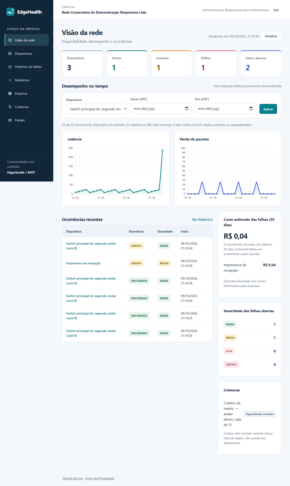
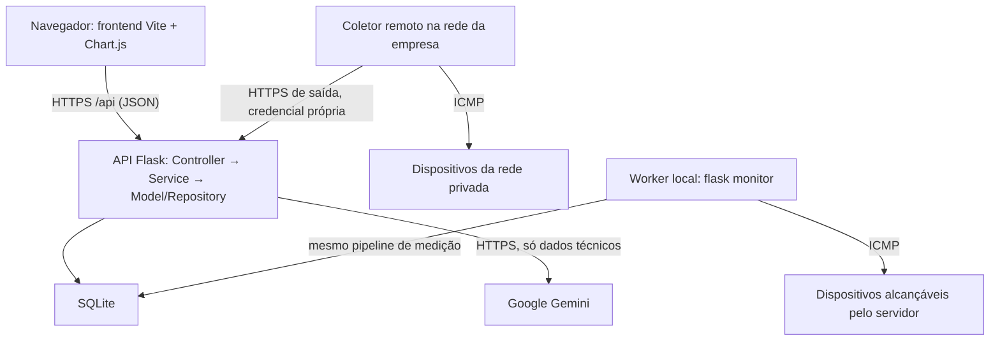

# EdgeHealth

Pequenas e médias empresas costumam descobrir que a rede caiu quando alguém reclama, e raramente sabem a causa provável ou quanto a parada custou. O **EdgeHealth** é um SaaS de monitoramento e diagnóstico de redes para essas empresas e para o técnico de TI que as atende: um coletor instalado na rede da empresa mede os equipamentos (ICMP), o servidor detecta e acompanha as ocorrências, calcula a severidade, aponta a causa provável com recomendações e estima o prejuízo financeiro de cada parada.

O resultado aparece em um painel web multiempresa: dashboard com ranking de custo, histórico de ocorrências com diagnóstico, explicação da ocorrência em linguagem simples por IA (Gemini) e relatório exportável. Tudo é calculado a partir de medições reais; não há dados simulados no produto.

**Produção:** <https://marcelodomingos.pythonanywhere.com>

## Sumário

1. [Equipe](#equipe)
2. [Stack](#stack)
3. [Funcionalidades Implementadas](#funcionalidades-implementadas)
4. [Casos de uso e telas](#casos-de-uso-e-telas)
5. [Arquitetura](#arquitetura) (inclui [Cliente-servidor](#cliente-servidor))
6. [Banco de dados](#banco-de-dados)
7. [Rotas da API](#rotas-da-api)
8. [Como executar](#como-executar)
9. [Coletor remoto](#coletor-remoto)
10. [Explicar ocorrência com IA](#explicar-ocorrência-com-ia)
11. [Hospedagem](#hospedagem)
12. [Testes e status](#testes-e-status)
13. [Documentação complementar](#documentação-complementar)

## Equipe

Turma: **[PS-3B1/2026] Projeto de Software — Colégio Cotemig**

| Integrante | Matrícula |
| --- | --- |
| Marcelo Domingos | 22400362 |
| Marcelo Rodrigues Alves do Nascimento | 12400815 |
| Erick Daniel Coelho E Silva | 12401188 |
| Felipe Barbosa Poeiras | 12402320 |
| Matheus Brito Vaz Bernardes | 12502391 |
| João Lucas Santos Batista | 12401617 |

## Stack

Versões conferidas em `backend/requirements.txt`, `frontend/package.json` e `collector/`.

| Parte | Tecnologias |
| --- | --- |
| **Frontend** | JavaScript (módulos ES, sem framework), Vite 8.2.2, Chart.js 4.5.1, HTML/CSS responsivo. Testes: jsdom 26.1.0 e playwright-core 1.63. Node.js 22.12 ou superior. |
| **Backend** | Python 3.12, Flask 3.1.3, Flask-SQLAlchemy 3.1.1 / SQLAlchemy 2.0.52, python-dotenv 1.2.3, icmplib 3.0.4 (ICMP), tzdata 2026.5, waitress 3.0.2 (servidor WSGI local). Testes: pytest. |
| **Banco de dados** | SQLite, esquema versionado com Flask-Migrate 4.1.0 / Alembic; script DDL em [`backend/database/create_database.sql`](backend/database/create_database.sql). |
| **IA** | Google Gemini (API REST `generateContent`), modelo padrão `gemini-3.5-flash-lite`, chamada pela biblioteca padrão (`urllib`), sem SDK. |
| **Hospedagem** | PythonAnywhere (plano gratuito), Flask servindo a API e o build do frontend na mesma origem, HTTPS. |
| **Coletor** | Python 3.12 + icmplib 3.0.4; executável Windows com PyInstaller 6.22.3, interface tkinter e tarefa agendada. |

## Funcionalidades Implementadas

Cada linha funciona de ponta a ponta: tela → rota → Controller → Service → Model/Repository → banco. ★ = funcionalidade principal que vai além de CRUD. `backend/tests/test_readme.py` confere que toda rota, Service, Model/Repository e tela desta tabela existem no código.

| Nº | Funcionalidade | Tela | Rota | Service | Repository / Model |
| --- | --- | --- | --- | --- | --- |
| 1 | Cadastrar empresa e administrador, com aceite dos Termos | `frontend/src/pages/Login.js` | `POST /api/auth/registro` | `RegistrarEmpresaService` | `Empresa`, `Usuario`, `AuthSession` |
| 2 | Entrar com sessão segura e limite de tentativas | `frontend/src/pages/Login.js` | `POST /api/auth/login` | `AutenticarUsuarioService` | `AutenticacaoRepository.contar_tentativas`, `LoginAttempt` |
| 3 | Aceitar Termos de Uso no primeiro acesso | `frontend/src/pages/Login.js` | `POST /api/auth/aceite-termos` | `AceitarTermosService` | `Usuario` |
| 4 | Sair (revoga a sessão) | `frontend/src/app.js` | `POST /api/auth/logout` | `EncerrarSessaoService` | `AuthSession` |
| 5 | Editar dados da empresa | `frontend/src/pages/Empresa.js` | `PUT /api/empresa` | `AtualizarEmpresaService` | `Empresa` |
| 6 | Configurar custos da empresa (assistente de custos) | `frontend/src/pages/Empresa.js` | `PUT /api/empresa/custos` | `ConfigurarCustosService` | `Empresa` |
| 7 | Cadastrar membro da equipe | `frontend/src/pages/Usuarios.js` | `POST /api/usuarios` | `CadastrarUsuarioService` | `Usuario`, `UsuarioRepository.listar_da_empresa` |
| 8 | Editar, promover ou desativar membro | `frontend/src/pages/Usuarios.js` | `PUT /api/usuarios/<id>` | `AtualizarUsuarioService` | `UsuarioRepository.buscar_da_empresa`, `AutenticacaoRepository.remover_sessoes_do_usuario` |
| 9 | Listar dispositivos (ativos e arquivados) | `frontend/src/pages/Dispositivos.js` | `GET /api/dispositivos` | `ListarDispositivosService` | `DispositivoRepository.listar_da_empresa` |
| 10 | Cadastrar dispositivo | `frontend/src/pages/Dispositivos.js` | `POST /api/dispositivos` | `CadastrarDispositivoService` | `Dispositivo` |
| 11 | Sugerir impacto padrão pelo tipo do dispositivo | `frontend/src/pages/Dispositivos.js` | `GET /api/dispositivos/impacto-padrao` | `ObterImpactoPadraoService` | `Empresa` |
| 12 | Editar dispositivo | `frontend/src/pages/Dispositivos.js` | `PUT /api/dispositivos/<id>` | `AtualizarDispositivoService` | `Dispositivo`, `FalhaRepository.aberta_do_dispositivo` |
| 13 | Arquivar dispositivo (preserva o histórico) | `frontend/src/pages/Dispositivos.js` | `DELETE /api/dispositivos/<id>` | `ArquivarDispositivoService` | `Dispositivo`, `FalhaRepository.aberta_do_dispositivo` |
| 14 | Desarquivar dispositivo | `frontend/src/pages/Dispositivos.js` | `POST /api/dispositivos/<id>/desarquivar` | `DesarquivarDispositivoService` | `Dispositivo`, `DispositivoRepository.existe_ip_ativo` |
| 15 | Solicitar coleta imediata | `frontend/src/pages/Dispositivos.js` | `POST /api/dispositivos/<id>/coletas` | `SolicitarColetaService` | `Dispositivo` |
| 16 | Consultar histórico de métricas (latência e perda) | `frontend/src/pages/Dispositivos.js` | `GET /api/metricas` | `ListarMetricasService` | `MetricaRepository.por_periodo` |
| 17 | Cadastrar coletor remoto (credencial exibida uma vez) | `frontend/src/pages/Coletores.js` | `POST /api/coletores` | `CadastrarColetorService` | `Coletor` |
| 18 | Rotacionar a credencial do coletor | `frontend/src/pages/Coletores.js` | `POST /api/coletores/<id>/rotacionar` | `RotacionarCredencialColetorService`, `ObterColetorService` | `Coletor`, `ColetorRepository.buscar_da_empresa` |
| 19 | Revogar coletor | `frontend/src/pages/Coletores.js` | `POST /api/coletores/<id>/revogar` | `RevogarColetorService`, `ObterColetorService` | `Coletor`, `ColetorRepository.buscar_da_empresa` |
| 20 | ★ Detectar falhas a partir das medições do coletor (status, abertura e encerramento de ocorrências, severidade) | `collector/edgehealth_collector.py` | `POST /api/coletor/amostras` | `ReceberAmostrasService`, `RegistrarMedicaoService`, `CalcularSeveridadeService` | `Metrica`, `Falha`, `MetricaRepository.uids_existentes` |
| 21 | Histórico de ocorrências com filtros e paginação | `frontend/src/pages/Historico.js` | `GET /api/falhas` | `ListarFalhasService` | `FalhaRepository.historico` |
| 22 | ★ Diagnóstico lógico da ocorrência com causas prováveis e recomendações | `frontend/src/pages/Falha.js` | `GET /api/falhas/<id>` | `AnalisarFalhaService`, `ObterFalhaService` | `Diagnostico`, `DiagnosticoRepository.recomendacoes_das_regras` |
| 23 | Registrar impacto (usuários afetados, custos diretos) e recalcular severidade | `frontend/src/pages/Falha.js` | `PUT /api/falhas/<id>/impacto` | `RegistrarImpactoService`, `CalcularSeveridadeService` | `Impacto` |
| 24 | ★ Estimar o prejuízo financeiro da ocorrência (expediente, pessoas, grupo compartilhado) | `frontend/src/pages/Falha.js` | `GET /api/falhas/<id>` | `EstimarPrejuizoFalhaService`, `IdentificarGrupoCompartilhadoService` | `FalhaRepository.grupo_compartilhado` |
| 25 | ★ Explicar a ocorrência com IA (Gemini) em linguagem simples | `frontend/src/pages/Falha.js` | `POST /api/falhas/<id>/explicacao-ia` | `ExplicarFalhaComIaService`, `GeminiService` | `Falha`, `Diagnostico`, `DiagnosticoRepository.recomendacoes_do_diagnostico` |
| 26 | ★ Dashboard com estados, severidades, gráficos e ranking de dispositivos por custo | `frontend/src/pages/Dashboard.js` | `GET /api/dashboard` | `GerarDashboardService`, `ResumirPrejuizoService` | `DashboardRepository.contagem_por_status`, `RankingCustoRepository.top_dispositivos` |
| 27 | ★ Exportar relatório ZIP (CSV de dispositivos, métricas, falhas e diagnósticos) | `frontend/src/pages/Relatorios.js` | `GET /api/relatorios/exportar` | `ExportarRelatorioService` | `RelatorioRepository.falhas_sobrepostas` |

## Casos de uso e telas

Os seis casos de uso dos [fluxogramas](docs/fluxogramas.md) e as telas em que acontecem. Capturas com dados fictícios, geradas por `frontend/tests/support/telas.mjs` (`npm run build && node tests/support/telas.mjs` em `frontend/`).

| Caso de uso | Tipo | Tela |
| --- | --- | --- |
| 1. Cadastrar dispositivo | Entrada de dados | [Dispositivos](docs/img/telas/dispositivos.png) · [formulário](docs/img/telas/modal-dispositivo.png) |
| 2. Coletor envia amostras e o sistema detecta a falha | Entrada de dados | [Coletores](docs/img/telas/coletores.png) · [métricas do dispositivo](docs/img/telas/modal-metricas.png) |
| 3. Registrar o impacto de uma ocorrência | Entrada de dados | [Ocorrência: impacto, prejuízo e diagnóstico](docs/img/telas/falha.png) |
| 4. Histórico de falhas com filtros e paginação | Recuperação de dados | [Histórico de falhas](docs/img/telas/historico.png) |
| 5. Visão da rede (dashboard) | Recuperação de dados | [Visão da rede](docs/img/telas/visao-da-rede.png) |
| 6. Explicar ocorrência com IA | Recuperação de dados com IA | [Ocorrência: painel "Explicação com IA"](docs/img/telas/falha.png) |

Outras telas: [login](docs/img/telas/login.png), [cadastro da empresa com aceite dos Termos](docs/img/telas/cadastro.png), [relatórios](docs/img/telas/relatorios.png), [empresa e custos](docs/img/telas/empresa.png) e [equipe](docs/img/telas/equipe.png).



## Arquitetura

### Cliente-servidor

O frontend e o backend são **aplicações separadas** que conversam somente por HTTP/JSON:

- `frontend/` — cliente web (Vite + JavaScript). Em desenvolvimento roda em `http://localhost:5173`, e o Vite encaminha `/api` para o Flask (`API_PROXY_TARGET` muda o destino).
- `backend/` — API REST Flask em `http://127.0.0.1:5000/api`. Não gera HTML de páginas: devolve JSON.
- `collector/` — terceiro cliente da mesma API, instalado na rede da empresa, que envia medições com credencial própria.

Em produção, `npm run build` gera `frontend/dist/` e o Flask serve esses arquivos estáticos junto com a API, na mesma origem (sem CORS e com o cookie de sessão protegido). Continua sendo cliente-servidor: o navegador baixa o cliente e consome a API por `fetch` (`frontend/src/services/api.js`).

**Prova com os dois servidores separados** (dois terminais, ver [Como executar](#como-executar)):

```bash
# terminal 1, em backend/: API Flask na porta 5000
python -m flask --app run.py run --port 5000
# terminal 2, em frontend/: cliente Vite na porta 5173
npm run dev
# terminal 3: cada servidor responde pelo seu papel
curl -i http://127.0.0.1:5000/api/health   # 200 application/json {"status":"ok"} (Server: Werkzeug)
curl -i http://127.0.0.1:5173/             # 200 text/html com <script src="/src/app.js"> (Vite)
curl -i http://127.0.0.1:5173/api/health   # 200 application/json: o Vite repassa à API por HTTP
```

Na auditoria de 09/10/2026 os dois ficaram escutando em processos diferentes (`netstat`: `:5173` e `:5000` com PIDs distintos) e o log do Flask registrou as requisições `GET /api/health` que chegaram pelo Vite ([docs/AUDITORIA.md](docs/AUDITORIA.md)).



Um servidor na Internet não alcança `192.168.x.x` da empresa; por isso cada dispositivo é medido pelo **worker local** ou por um **coletor remoto**. O coletor só mede e envia: status, ocorrências, severidade e diagnóstico são sempre calculados no servidor, pelo mesmo `RegistrarMedicaoService`.

### API em camadas

**Diagramas:**

- **Diagrama de classes:** [`docs/diagrama-classes.md`](docs/diagrama-classes.md) (imagem: [`docs/img/diagrama-classes.svg`](docs/img/diagrama-classes.svg)), gerado dos Models por `docs/gerar_diagrama_classes.py`; `backend/tests/test_diagram.py` garante que corresponde ao código.
- **Fluxogramas dos casos de uso:** [`docs/fluxogramas.md`](docs/fluxogramas.md), com 6 casos de uso (entrada e recuperação de dados, incluindo a explicação com IA) passando por Tela → Controller → Service → Model/Repository → Banco (imagens em [`docs/img/`](docs/img/)); `backend/tests/test_flowcharts.py` garante que toda classe e método citados existem.

Toda funcionalidade segue o mesmo fluxo:

```text
Tela → API Flask → Controller → Service → Model / Repository → Banco
```

```text
backend/
├── app/                  infraestrutura do Flask (sem regra de negócio)
│   ├── __init__.py       create_app: configuração, banco, blueprint, erros e cabeçalhos
│   ├── config.py         variáveis de ambiente
│   ├── extensions.py     SQLAlchemy e Flask-Migrate
│   ├── security.py       decorators require_auth / require_collector e cookies de sessão
│   ├── validation.py     validação de campos (funções puras, usadas pelos services)
│   └── cli.py            comandos flask (monitor, probe, backup, purge-history...)
├── controllers/          uma classe por recurso + rotas.py (Blueprint 'api')
├── services/             uma classe por caso de uso, método executar(), por recurso
│   ├── autenticacao/  empresas/  usuarios/  dispositivos/  metricas/  falhas/
│   ├── diagnosticos/  dashboard/  relatorios/  coletores/  coletor_api/
│   ├── monitoramento/    sonda ICMP, classificação de status, registro de medição, lease
│   ├── custos/           cálculo do prejuízo estimado (expediente, grupo compartilhado)
│   ├── ia/               GeminiService (única classe que chama a IA) e limite de uso
│   ├── privacidade/  legado/  saude/
│   └── comum/            serialização JSON das entidades e hash de credenciais
├── models/               um arquivo por entidade; base.py com o CRUD comum
├── repositories/         consultas especiais (SQL) e controle de transação
├── database/             create_database.sql (DDL gerado das migrations), gerador e README
├── migrations/           Alembic (fonte da verdade do esquema)
└── tests/
```

| Camada | Papel | Não pode |
| --- | --- | --- |
| **Controller** (`controllers/`) | Recebe a requisição HTTP, lê o JSON, a query string e o usuário autenticado, chama o service e devolve a resposta (status e JSON). `rotas.py` liga cada URL e método HTTP a um método de controller, com a autenticação exigida. | Ter regra de negócio ou acessar o banco (`sqlalchemy`/`db`). |
| **Service** (`services/`) | Um caso de uso por classe (`CadastrarDispositivoService`, `RegistrarImpactoService`, `ReceberAmostrasService`...). Valida os dados, aplica as regras e coordena models, repositories e a transação. As regras de domínio também são classes: `RegistrarMedicaoService` (status e ciclo das ocorrências), `AnalisarFalhaService` e `CalcularSeveridadeService` (diagnóstico), `CalculadoraPrejuizo` (custos), `SondaIcmpService` (ICMP) e `GeminiService` (IA). Recebe usuário e empresa como parâmetros. | Ler `flask.request`/`flask.g` ou executar SQL. |
| **Model** (`models/`) | Mapeamento de cada tabela. Todos herdam `BaseModel`, com `salvar()`, `atualizar()`, `deletar()`, `listar_todos()` e `buscar_por_id()` (`commit=False` mantém a operação na transação do caso de uso). | Conter consultas especiais ou regras de caso de uso. |
| **Repository** (`repositories/`) | Somente consultas especiais (ver [Banco de dados](#banco-de-dados)). `Transacao` confirma ou desfaz a transação. | Repetir o CRUD dos models. |

`tests/test_architecture.py` falha se um controller importar `sqlalchemy`/`db`, se um service usar `flask.request`/`flask.g` ou SQL, ou se faltar uma das cinco operações de CRUD na classe base dos models.

## Banco de dados

Pasta [`backend/database/`](backend/database/): [`create_database.sql`](backend/database/create_database.sql) cria o banco SQLite completo (tabelas, chaves, `CHECK`, índices parciais, revisão Alembic e catálogo de recomendações). Ele é gerado das migrations por `gerar_create_database.py`, e `tests/test_database_script.py` garante que os dois produzem o mesmo esquema. Como criar o banco, justificativa do SQLite e detalhes: [`backend/database/README.md`](backend/database/README.md).

**Stored Procedures:** o SQLite não tem Stored Procedures. As consultas especiais ficam nos **Repositories** (`backend/repositories/`), em SQL escrito à mão com `text()` e parâmetros nomeados ou em SQLAlchemy Core, que gera SQL parametrizado. As regras de integridade ficam no próprio banco (`FOREIGN KEY`, `UNIQUE`, `CHECK`, índices parciais).

### Models

| Entidade | Arquivo | Tabela |
| --- | --- | --- |
| `Empresa` | `backend/models/empresa.py` | `empresas` |
| `Usuario` | `backend/models/usuario.py` | `usuarios` |
| `AuthSession` | `backend/models/auth_session.py` | `auth_sessions` |
| `LoginAttempt` | `backend/models/login_attempt.py` | `login_attempts` |
| `Coletor` | `backend/models/coletor.py` | `coletores` |
| `Dispositivo` | `backend/models/dispositivo.py` | `dispositivos` |
| `Metrica` | `backend/models/metrica.py` | `metricas` |
| `Falha` | `backend/models/falha.py` | `falhas` |
| `Impacto` | `backend/models/impacto.py` | `impactos` |
| `Diagnostico` | `backend/models/diagnostico.py` | `diagnosticos` |
| `Recomendacao` | `backend/models/recomendacao.py` | `recomendacoes` |
| `DiagnosticoRecomendacao` | `backend/models/diagnostico_recomendacao.py` | `diagnostico_recomendacoes` |
| `RegistroLegado` | `backend/models/registro_legado.py` | `registros_legados` |

### Consultas especiais dos Repositories

`text()` = SQL escrito à mão. Core = SQLAlchemy Core (`select`/`join`/`where`/`update`/`delete`). Todas são testadas com resultado exato em `tests/test_repositories.py`.

| Método | O que consulta | Tipo de SQL |
| --- | --- | --- |
| `DashboardRepository.contagem_por_status` | dispositivos ativos por status (`SEM_COLETA` = nunca medido) | `text()`: `COALESCE` + `GROUP BY` |
| `DashboardRepository.contagem_por_severidade` | falhas abertas da empresa por severidade | `text()`: `JOIN` + `GROUP BY` |
| `FalhaRepository.ranking_dispositivos` | falhas por dispositivo no período (total, abertas, indisponibilidades) | `text()`: `JOIN` + `GROUP BY` + `ORDER BY` + `LIMIT` |
| `RankingCustoRepository.top_dispositivos` | top 5 dispositivos por prejuízo estimado | `text()`: CTE `VALUES` + `LEFT JOIN` + `ORDER BY` + `LIMIT` |
| `FalhaRepository.historico` | histórico filtrado por dispositivo, estado, severidade e período, paginado | Core: `JOIN` + `WHERE` + `COUNT` + `LIMIT/OFFSET` |
| `FalhaRepository.grupo_compartilhado` | indisponibilidades da empresa na janela de correlação | Core: `JOIN` + intervalo |
| `FalhaRepository.encerradas_desde` / `ids_anteriores_do_dispositivo` | falhas relacionadas e recorrência para o diagnóstico | Core: `JOIN` + intervalo + `LIMIT` |
| `MetricaRepository.por_periodo` / `serie_do_dispositivo` | amostras por período e série do gráfico | Core: `JOIN` + intervalo + `COUNT` + `LIMIT` |
| `RelatorioRepository.falhas_sobrepostas` / `metricas` | dados do relatório: falhas sobrepostas ao período e amostras | Core: `JOIN` + sobreposição de períodos |
| `*.buscar_da_empresa` (Dispositivo, Falha, Métrica, Coletor, Usuário, Diagnóstico) | registro por id somente da empresa logada (multiempresa) | Core: `JOIN` até `dispositivos.empresa_id` |
| `DispositivoRepository.ids_devidos_para_coleta` | dispositivos do worker com coleta vencida | Core: `WHERE` + `ORDER BY` + `LIMIT` |
| `DispositivoRepository.reservar_para_worker` / `reservar_para_coletor` | lease exclusivo do dispositivo (só uma requisição consegue) | Core: `UPDATE ... WHERE` atômico |
| `RetencaoRepository.expurgar` | amostras e registros de segurança vencidos | Core: `COUNT` + `DELETE` |

## Rotas da API

Todas sob o prefixo `/api`. **Acesso:** *público* = sem login; *técnico* = qualquer membro logado da empresa (o administrador também); *admin* = só administrador; *coletor* = credencial do coletor (`Authorization: Bearer ehc_...`, sem cookie). Rotas de técnico e admin exigem os Termos aceitos, exceto as de `AuthController` marcadas como técnico. Um id de outra empresa responde 404.

| Controller | Método | URL | Acesso |
| --- | --- | --- | --- |
| `HealthController` | GET | `/api/health` | público |
| `AuthController` | GET | `/api/termos` | público |
| `AuthController` | POST | `/api/auth/registro` | público |
| `AuthController` | POST | `/api/auth/login` | público |
| `AuthController` | GET | `/api/auth/me` | técnico |
| `AuthController` | POST | `/api/auth/aceite-termos` | técnico |
| `AuthController` | POST | `/api/auth/logout` | técnico |
| `EmpresaController` | GET | `/api/empresa` | técnico |
| `EmpresaController` | PUT | `/api/empresa` | admin |
| `EmpresaController` | PUT | `/api/empresa/custos` | admin |
| `EmpresaController` | POST | `/api/empresa/custos/pular` | admin |
| `UsuarioController` | GET | `/api/usuarios` | admin |
| `UsuarioController` | POST | `/api/usuarios` | admin |
| `UsuarioController` | PUT | `/api/usuarios/<id>` | admin |
| `DispositivoController` | GET | `/api/dispositivos` | técnico |
| `DispositivoController` | GET | `/api/dispositivos/<id>` | técnico |
| `DispositivoController` | POST | `/api/dispositivos` | técnico |
| `DispositivoController` | PUT | `/api/dispositivos/<id>` | técnico |
| `DispositivoController` | GET | `/api/dispositivos/impacto-padrao` | técnico |
| `DispositivoController` | DELETE | `/api/dispositivos/<id>` | técnico |
| `DispositivoController` | POST | `/api/dispositivos/<id>/desarquivar` | técnico |
| `DispositivoController` | POST | `/api/dispositivos/<id>/coletas` | técnico |
| `MetricaController` | GET | `/api/metricas` | técnico |
| `MetricaController` | GET | `/api/metricas/<id>` | técnico |
| `FalhaController` | GET | `/api/falhas` | técnico |
| `FalhaController` | GET | `/api/falhas/<id>` | técnico |
| `FalhaController` | PUT | `/api/falhas/<id>/impacto` | técnico |
| `FalhaController` | POST | `/api/falhas/<id>/explicacao-ia` | técnico |
| `DiagnosticoController` | GET | `/api/diagnosticos/<id>` | técnico |
| `DiagnosticoController` | GET | `/api/recomendacoes` | técnico |
| `DashboardController` | GET | `/api/dashboard` | técnico |
| `RelatorioController` | GET | `/api/relatorios/exportar` | técnico |
| `ColetorController` | GET | `/api/coletores` | técnico |
| `ColetorController` | POST | `/api/coletores` | admin |
| `ColetorController` | POST | `/api/coletores/<id>/rotacionar` | admin |
| `ColetorController` | POST | `/api/coletores/<id>/revogar` | admin |
| `ColetorApiController` | GET | `/api/coletor/configuracao` | coletor |
| `ColetorApiController` | POST | `/api/coletor/heartbeat` | coletor |
| `ColetorApiController` | POST | `/api/coletor/amostras` | coletor |

Erros retornam JSON (`{"erro": ...}`) com HTTP 400/401/403/404/409/422/429/502/503 e desfazem a transação. Alterações com sessão exigem o cabeçalho CSRF.

## Como executar

### Pré-requisitos

- Python 3.12 ou superior e Node.js 22.12 ou superior (com npm).
- Para medir de verdade: permissão do sistema operacional para ICMP e acesso à rede dos dispositivos.

### Backend

Windows (PowerShell), a partir da raiz do repositório:

```powershell
cd backend
py -3 -m venv .venv
.venv\Scripts\Activate.ps1
python -m pip install -r requirements-dev.lock
if (!(Test-Path .env)) { Copy-Item .env.example .env }
python -m flask --app run.py db upgrade
python -m flask --app run.py seed-catalog
python -m flask --app run.py run
```

Linux/macOS:

```bash
cd backend
python3 -m venv .venv
source .venv/bin/activate
python -m pip install -r requirements-dev.lock
cp -n .env.example .env
python -m flask --app run.py db upgrade
python -m flask --app run.py seed-catalog
python -m flask --app run.py run
```

A API fica em `http://127.0.0.1:5000/api` (`python run.py` faz o mesmo). O `.env` nunca vai para o Git; revise-o a partir do `.env.example`. `seed-catalog` só cria o catálogo de 8 recomendações e é idempotente; não há usuários ou dispositivos de exemplo. Para o worker local medir os dispositivos, abra outro terminal no `backend/` com o mesmo ambiente virtual e rode `python -m flask --app run.py monitor`. Já existe um banco do protótipo antigo? Siga [docs/LEGACY.md](docs/LEGACY.md) antes do `db upgrade`.

### Frontend

Em outro terminal (igual no PowerShell e no Linux):

```bash
cd frontend
npm install
npm run dev
```

Abra `http://localhost:5173` e escolha **Cadastrar minha empresa**. Para servir sem o Vite, como em produção: `npm run build` e, no `backend/`, `waitress-serve --listen=127.0.0.1:5000 run:app` (abrir `http://localhost:5000`).

### Testes

```powershell
# backend (PowerShell ou bash, com o ambiente virtual ativo)
cd backend
python -m pytest -q

# frontend (usa o .venv do backend para subir uma API temporária)
cd frontend
npm test
```

Teste opcional de ICMP real (loopback): `EDGEHEALTH_TEST_REAL_NETWORK=1 python -m pytest -m real_network -q` no bash, ou `$env:EDGEHEALTH_TEST_REAL_NETWORK='1'; python -m pytest -m real_network -q` no PowerShell.

Variáveis de configuração (limites de latência e perda, intervalo de coleta, retenção etc.) estão comentadas em `backend/.env.example`; produção em [docs/DEPLOY.md](docs/DEPLOY.md).

## Coletor remoto

O coletor roda dentro da rede da empresa, mede os dispositivos atribuídos a ele e envia as amostras por HTTPS de saída (fila em disco quando a Internet cai). Instalação, comandos e segurança: [collector/README.md](collector/README.md).

- Windows: baixe o [`EdgeHealthColetor.exe`](https://github.com/MarceloRodriguesDoNascimento/EdgeHealth/releases/latest/download/EdgeHealthColetor.exe) da [página de Releases](https://github.com/MarceloRodriguesDoNascimento/EdgeHealth/releases/latest) (confira o SHA-256 publicado lá) ou use **Coletores → Baixar coletor para Windows** no site.
- Linux/macOS ou Python: `python collector/edgehealth_collector.py --api-url <URL do servidor> --token-file coletor.token`.

A credencial é criada em **Coletores** (admin), mostrada uma única vez e nunca gravada em log.

## Explicar ocorrência com IA

Na tela da ocorrência, **Explicar com IA** gera, em português simples para um gestor, o que aconteceu, o impacto provável e os próximos passos, a partir do diagnóstico e das recomendações que o sistema já calculou. A IA explica; o diagnóstico por regras não muda.

- Fluxo: `Falha.js` → `POST /api/falhas/<id>/explicacao-ia` → `FalhaController.explicar_com_ia` → `ExplicarFalhaComIaService` → `GeminiService`. Fluxograma 6 em [`docs/fluxogramas.md`](docs/fluxogramas.md).
- Configuração no `backend/.env` (nunca no Git): `GEMINI_API_KEY` (sem ela o botão aparece desabilitado), `GEMINI_MODEL` (padrão `gemini-3.5-flash-lite`) e `IA_EXPLICACOES_POR_HORA` (padrão 10 por empresa).
- Privacidade: só dados técnicos são enviados, nunca nomes, e-mails, CNPJ, nome da empresa ou IP ([`docs/LGPD.md`](docs/LGPD.md), seção 6).
- Erros: sem chave **503**; cota, rede, modelo sobrecarregado ou timeout de 20 s **503**; chave inválida ou resposta vazia **502**; limite por empresa **429**.

## Hospedagem

A aplicação está publicada em **<https://marcelodomingos.pythonanywhere.com>** (PythonAnywhere, plano gratuito: o Flask serve a API e o build do frontend). Passo a passo da implantação, atualização e limites do plano: [docs/PYTHONANYWHERE.md](docs/PYTHONANYWHERE.md); outras opções de hospedagem: [docs/DEPLOY.md](docs/DEPLOY.md).

As **credenciais de demonstração são entregues ao professor pelo Google Classroom**. Este repositório é público: nenhuma senha, e-mail de conta, chave de API ou credencial de coletor fica no código ou na documentação.

## Testes e status

Validação de 09/10/2026 (Windows 11, Python 3.12.10, Node 24):

- **Backend:** 185 testes aprovados e 3 pulados (os opcionais de ICMP real).
- **Frontend:** 20 de 20 aprovados (jsdom, API HTTP real temporária, build servido pelo Flask, proxy Vite e telas responsivas).

As suítes cobrem também a documentação: `test_readme.py` (tabela de funcionalidades, rotas e links), `test_flowcharts.py`, `test_diagram.py`, `test_database_script.py` e `test_architecture.py`.

Limites conhecidos: o MVP mede de um ponto de rede por dispositivo, não descobre topologia; usuários afetados são estimados pela equipe; o diagnóstico aponta hipóteses, não certezas. As minutas jurídicas ([Termos](frontend/public/termos.html), [Privacidade](frontend/public/privacidade.html), [LGPD.md](docs/LGPD.md)) precisam de revisão pelos responsáveis.

## Documentação complementar

| Documento | Conteúdo |
| --- | --- |
| [docs/AUDITORIA.md](docs/AUDITORIA.md) | Auditoria do projeto contra a rubrica da disciplina |
| [docs/diagrama-classes.md](docs/diagrama-classes.md) | Diagrama de classes do domínio |
| [docs/fluxogramas.md](docs/fluxogramas.md) | Fluxogramas dos 6 casos de uso |
| [backend/database/README.md](backend/database/README.md) | Script do banco, SQLite e Stored Procedures |
| [docs/PYTHONANYWHERE.md](docs/PYTHONANYWHERE.md) | Hospedagem gratuita usada na demonstração |
| [docs/DEPLOY.md](docs/DEPLOY.md) | Produção, variáveis, backup e restauração |
| [docs/LGPD.md](docs/LGPD.md) | Inventário de dados, bases legais, operadores (Google, PythonAnywhere) |
| [docs/DEMO.md](docs/DEMO.md) | Roteiro de demonstração |
| [docs/LEGACY.md](docs/LEGACY.md) | Importação do banco do protótipo |
| [collector/README.md](collector/README.md) | Coletor remoto e executável Windows |

Operação do servidor (no `backend/`, com o ambiente virtual ativo): `flask --app run.py backup --output CAMINHO.db` (cópia consistente), `flask --app run.py purge-history --dry-run` (retenção de 180 dias) e `flask --app run.py anonymize-user --email PESSOA --yes` (pedido de titular).
