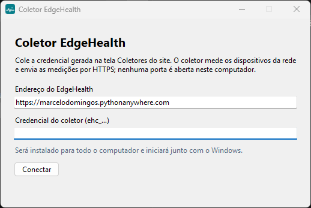
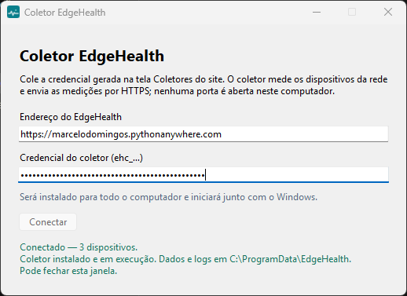
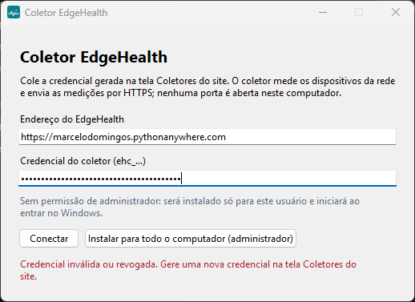
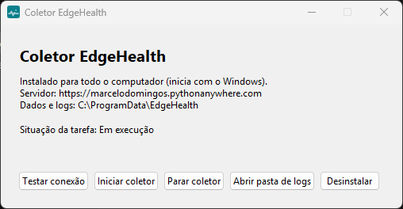

# Coletor remoto EdgeHealth

O coletor roda **dentro da rede da empresa**. Ele mede os dispositivos atribuídos a ele na interface (ICMP: pacotes enviados/recebidos e latência) e envia as amostras ao EdgeHealth hospedado por **HTTPS**. Usa somente conexões de saída; nenhuma porta de entrada é aberta na rede e nenhum equipamento é exposto à Internet.

O coletor **não decide** status, falhas, severidade ou diagnóstico. Essas regras ficam no servidor, no mesmo pipeline do worker local.

## Como funciona

1. A cada 30 s (ou no intervalo configurado no servidor, se menor), busca `GET /api/coletor/configuracao`: lista de dispositivos, intervalo, pacotes e timeout.
2. Mede os dispositivos vencidos, com concorrência limitada (`--workers`, padrão 4).
3. Grava cada amostra em uma fila local em disco (`--queue-file`), limitada (`--max-queue`, padrão 5000; as mais antigas são descartadas primeiro).
4. Envia em lotes (`POST /api/coletor/amostras`). Cada amostra tem um UUID. Reenvios são idempotentes: o servidor responde `DUPLICADA` e não grava de novo.
5. Se a API estiver indisponível, continua medindo e guarda na fila. As novas tentativas usam backoff exponencial de 2 s a 300 s, com variação aleatória.
6. Envia heartbeat com a versão e o tamanho da fila. Sem contato por `COLLECTOR_STALE_SECONDS` (padrão 180 s), a interface mostra o coletor como **Sem contato recente**. Isso indica falta de dados, não queda de dispositivos.
7. Sem permissão para ICMP, envia o erro `PERMISSAO_ICMP`. O dispositivo exibe o erro, sem amostra, sem OFFLINE e sem falha.

Respostas do servidor por amostra: `ACEITA`, `DUPLICADA`, `ATRASADA` (mais antiga que a última processada: entra no histórico sem mudar o estado nem reabrir ocorrência), `REJEITADA` (inválida ou dispositivo não atribuído) e `TENTAR_NOVAMENTE` (o dispositivo está sendo processado; a amostra permanece na fila).

## 1. Criar a credencial

Na interface, como administrador: **Coletores → Cadastrar coletor**. Copie a credencial (`ehc_...`). **Ela é exibida uma única vez.** O servidor guarda somente o hash.

Depois, em **Dispositivos → Editar → Origem da medição**, escolha o coletor para cada dispositivo da rede privada.

## 2. Instalar no Windows (sem terminal e sem Python)

Use um computador que fique ligado e conectado à rede que você quer monitorar.

1. No site, em **Coletores**, clique em **Baixar coletor para Windows**. O arquivo é o `EdgeHealthColetor.exe` (cerca de 12 MB).
2. Dê dois cliques no arquivo baixado.
3. **Aviso do Windows (SmartScreen).** Na primeira vez, pode aparecer a tela azul **"O Windows protegeu o computador"**. Ela aparece porque o programa ainda não tem assinatura digital paga, não porque foi encontrado algum problema. Clique em **Mais informações** e depois em **Executar assim mesmo**. Se o botão não aparecer, o computador é gerenciado pela empresa e a instalação precisa ser liberada pela equipe de TI.
   - Para conferir que o arquivo é o original, compare o SHA-256 publicado na página da versão (Releases do GitHub) com o resultado de `Get-FileHash EdgeHealthColetor.exe` no PowerShell.
4. Na janela **Coletor EdgeHealth**, o endereço do EdgeHealth já vem preenchido. Cole a credencial e clique em **Conectar**.

   

5. Se der certo, aparece **"Conectado — N dispositivos"** e o coletor é instalado e iniciado. Pode fechar a janela: ele continua rodando escondido e volta sozinho quando o Windows reiniciar.

   

   Se algo estiver errado, a mensagem diz o que fazer:

   

   | Mensagem | O que fazer |
   |---|---|
   | Credencial inválida ou revogada | Gere uma nova credencial em **Coletores → Nova credencial** e cole de novo. |
   | Sem conexão com o servidor | Verifique a internet do computador e o endereço do EdgeHealth. |
   | O relógio deste computador está N min adiantado/atrasado | **Configurações → Hora e idioma → Data e hora → Sincronizar agora**. O servidor recusa medições com relógio errado. |
   | A credencial começa com "ehc_" | Copie a credencial inteira da tela Coletores. |

6. No site, em **Coletores**, a situação passa a **Ativo** em até um minuto.

### Para todo o computador ou só para o seu usuário

- **Com permissão de administrador** (botão **Instalar para todo o computador**, que pede confirmação do Windows): o coletor inicia **junto com o Windows**, mesmo sem ninguém entrar, e guarda os dados em `C:\ProgramData\EdgeHealth`. É o recomendado para um computador que fica ligado.
- **Sem administrador**: o coletor inicia **quando você entra no Windows** e guarda os dados em `%LOCALAPPDATA%\EdgeHealth`.

Em ambos os casos ele roda como uma tarefa agendada oculta (**EdgeHealth Coletor**), sem janela, sem limite de tempo, também na bateria, e é reiniciado a cada minuto se parar com erro.

### Depois de instalado

Abra o `EdgeHealthColetor.exe` de novo (o baixado ou a cópia em `C:\ProgramData\EdgeHealth`) para ver a situação e usar os botões:



- **Testar conexão**: confere credencial, internet e relógio.
- **Parar coletor**: encerra o coletor e impede que ele inicie com o Windows, até você clicar em **Iniciar coletor**.
- **Abrir pasta de logs**: `logs\coletor.log`, com rotação (5 arquivos de 1 MB). A credencial nunca é gravada no log.
- **Desinstalar**: remove a tarefa agendada e toda a pasta de dados (credencial, fila e logs). Depois, apague o arquivo baixado. No site, use **Revogar** se o coletor não for mais usado.

Arquivos na pasta de dados, com acesso só para SISTEMA, Administradores e (instalação por usuário) o próprio usuário: `config.json` (endereço), `coletor.token` (credencial), `fila.jsonl` (medições ainda não enviadas), `logs\` e uma cópia do `EdgeHealthColetor.exe`.

**Instalação sem janela** (TI e implantação em massa), no PowerShell como administrador:

```powershell
.\EdgeHealthColetor.exe --instalar --url https://marcelodomingos.pythonanywhere.com --token-file C:\caminho\coletor.token
.\EdgeHealthColetor.exe --parar      # ou --iniciar / --desinstalar
```

## 3. Instalação manual pelo terminal (Linux e avançado)

### Windows pelo terminal (avançado)

Para quem prefere rodar o código-fonte. Requer Python 3.12 ou superior. Abra o PowerShell **na pasta `collector` do repositório** e confira com `Get-Location` que o caminho termina em `\collector`. Se o ZIP foi extraído em uma pasta dentro de outra com o mesmo nome, entre na pasta que contém `edgehealth_collector.py`.

```powershell
py -3 -m venv .venv
.\.venv\Scripts\Activate.ps1
python -m pip install -r requirements.txt
```

Espere a instalação terminar sem erros. Depois, salve a credencial em um arquivo com acesso restrito ao seu usuário. Substitua o texto entre aspas pela credencial copiada:

```powershell
Set-Content -Path .\coletor.token -Value "COLE_AQUI_A_CREDENCIAL" -NoNewline -Encoding ascii
icacls .\coletor.token /inheritance:r /grant:r "$($env:USERNAME):(R,W)"
```

Teste um ciclo. Use o endereço real da sua hospedagem; o domínio abaixo é só exemplo:

```powershell
python edgehealth_collector.py --api-url https://edgehealth.exemplo.org --token-file .\coletor.token --once
```

Execução contínua: `python edgehealth_collector.py --api-url https://edgehealth.exemplo.org --token-file .\coletor.token`. Para iniciar com o Windows, crie uma tarefa no **Agendador de Tarefas** ("Ao iniciar o sistema") que execute `.\.venv\Scripts\python.exe` com esses argumentos, na pasta `collector`.

No Windows 11 deste projeto, o ICMP funcionou sem privilégios de administrador. A latência medida tem granularidade de cerca de 0,5 ms. Um equipamento na mesma LAN pode aparecer com `0` ms, o mesmo que o `ping` do sistema mostra como `<1ms`.

Se aparecer `CERTIFICATE_VERIFY_FAILED: certificate has expired`, o repositório de certificados do Windows não aceita a cadeia atual do Let's Encrypt (aconteceu no Windows 11 deste projeto). Use o `EdgeHealthColetor.exe`, que traz o próprio pacote de certificados, ou instale o coletor no Linux.

### Linux (bash)

```bash
cd collector                # pasta que contém edgehealth_collector.py
python3 -m venv .venv
. .venv/bin/activate
python -m pip install -r requirements.txt
install -m 600 /dev/null coletor.token && nano coletor.token   # cole a credencial e salve
python edgehealth_collector.py --api-url https://edgehealth.exemplo.org --token-file coletor.token --once
```

O ICMP sem privilégios no Linux depende de `net.ipv4.ping_group_range`. Se aparecer `PERMISSAO_ICMP`, o administrador da máquina deve incluir o grupo do usuário do serviço nesse intervalo, por exemplo `sudo sysctl -w net.ipv4.ping_group_range="0 2147483647"`, e persistir em `/etc/sysctl.d/`. Não execute o coletor como root.

Exemplo de serviço systemd (`/etc/systemd/system/edgehealth-collector.service`; ajuste o usuário e os caminhos reais):

```ini
[Unit]
Description=EdgeHealth collector
After=network-online.target
[Service]
User=edgehealth
WorkingDirectory=/opt/edgehealth/collector
ExecStart=/opt/edgehealth/collector/.venv/bin/python edgehealth_collector.py --api-url https://edgehealth.exemplo.org --token-file /opt/edgehealth/collector/coletor.token
Restart=always
RestartSec=10
[Install]
WantedBy=multi-user.target
```

## Opções

| Opção | Variável | Padrão |
|---|---|---|
| `--api-url` | `EDGEHEALTH_API_URL` | obrigatório; HTTPS (HTTP somente para `localhost`) |
| `--token-file` | `EDGEHEALTH_COLLECTOR_TOKEN_FILE` | ou a credencial em `EDGEHEALTH_COLLECTOR_TOKEN` |
| `--queue-file` | `EDGEHEALTH_QUEUE_FILE` | `edgehealth-fila.jsonl` |
| `--max-queue` | `EDGEHEALTH_MAX_QUEUE` | 5000 (100–100000) |
| `--workers` | `EDGEHEALTH_WORKERS` | 4 (1–16) |
| `--once` | — | executa um ciclo e encerra |
| `--allow-http` | — | somente laboratório, sem TLS |

## Publicar uma nova versão do .exe (mantenedores)

1. No Windows, na raiz do repositório: `powershell -ExecutionPolicy Bypass -File collector\windowsuild.ps1`. Gera `collector\dist\EdgeHealthColetor.exe` e o arquivo `.sha256`. As versões das ferramentas estão fixas em `collector\windows
equirements-build.txt`.
2. No GitHub, crie uma release e anexe **exatamente** `EdgeHealthColetor.exe` (o link do site aponta para `releases/latest/download/EdgeHealthColetor.exe`). Cole o SHA-256 na descrição.
3. O `.exe` nunca vai para o repositório nem para o servidor do EdgeHealth.

## Operação

- **Atualizar o coletor:** pare o serviço, substitua `edgehealth_collector.py`, reinstale `requirements.txt` e inicie. A fila em disco é preservada.
- **Credencial perdida ou exposta:** em **Coletores**, use **Nova credencial**: a anterior para de funcionar imediatamente. Para desativar de vez, use **Revogar**.
- **Credencial inválida ou revogada:** o coletor encerra com código 2 e registra a mensagem no log, sem a credencial.
- **Relógio:** mantenha o NTP ativo. O servidor rejeita amostras com horário mais de 120 s no futuro e mais antigas que 24 h. O coletor avisa quando a diferença para o servidor passa de 60 s.
- **Um coletor por dispositivo:** o worker local do servidor nunca mede dispositivos atribuídos a um coletor. O mesmo lease por dispositivo serializa as ingestões.
- O coletor mede somente os endereços cadastrados. Não há descoberta ou varredura de rede.
