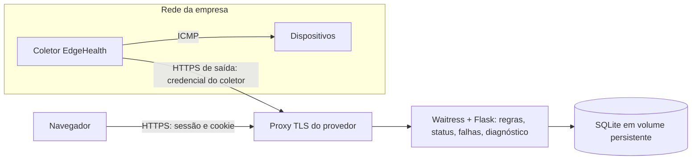

# Hospedagem e operação

Estado em 06/10/2026: **pronto para implantação, não implantado**. Nenhum provedor, domínio ou plano foi contratado, e nada foi publicado externamente. O Docker não está instalado na máquina de desenvolvimento, então a imagem **não foi construída nem testada**. O mesmo caminho de produção (migrations → `seed-catalog` → Waitress → coletor real por HTTP) foi validado sem contêiner; veja a seção 7.

## 1. Arquitetura hospedada



- O servidor na Internet **não alcança** IPs privados da empresa (`192.168.x.x`, `10.x.x.x`). Esses dispositivos precisam ser atribuídos a um coletor instalado na rede deles (`collector/README.md`).
- O worker local (`flask monitor`, ou `worker` no contêiner) só deve rodar no servidor para dispositivos que o próprio servidor alcança. Em hospedagem típica, ele pode ficar desligado.
- VPN entre o servidor e a rede da empresa seria uma alternativa de infraestrutura, mas **não existe nem foi configurada**.

## 2. SQLite continua adequado?

Sim, **com uma única instância do servidor web** e o banco em **disco persistente local** (volume). As escritas são serializadas por lease por dispositivo e por `busy_timeout`. O volume do MVP (dezenas de dispositivos a cada 30 s) está muito abaixo do limite do SQLite.

Não é adequado se o provedor usar **sistema de arquivos efêmero** (o banco some a cada deploy), **várias instâncias** ou **disco de rede** (NFS/SMB: risco de corrupção nos locks). Nesses casos, migrar para PostgreSQL exige:

- incluir o driver (`psycopg`);
- testar as migrations no PostgreSQL. A migration `bc4dfbaec175` já tem um caminho específico para dialetos diferentes do SQLite, mas **não foi executada** em PostgreSQL;
- substituir `flask backup` por `pg_dump`.

Essa migração não foi feita porque nenhum provedor foi escolhido.

## 3. Requisitos do provedor (escolha da equipe)

- Contêiner Docker **ou** máquina virtual com Python 3.12 e Node 22.
- Volume persistente montado em `/data`.
- HTTPS com certificado válido terminado em um proxy reverso. O app confia em exatamente 1 salto (`TRUST_PROXY=1`).
- Uma única réplica.

## 4. Variáveis de produção

| Variável | Valor de produção | Motivo |
|---|---|---|
| `DATABASE_URL` | `sqlite:////data/edgehealth.db` | Volume persistente |
| `COOKIE_SECURE` | `true` | Cookies só por HTTPS; também ativa o HSTS |
| `TRUST_PROXY` | `1` (número real de proxies) | IP real do cliente para o limite de login e o esquema HTTPS |
| `SESSION_HOURS` | 8 | Expiração da sessão |
| `METRIC_RETENTION_DAYS` | 180 | Retenção (`docs/LGPD.md`) |
| `TERMS_VERSION` | `2026-10` | Aumente ao mudar os Termos |
| Demais `MONITOR_*`, `COLLECTOR_*` | ver `backend/.env.example` | — |

O app não usa `SECRET_KEY`: as sessões são tokens aleatórios guardados como hash no banco. Não há outros segredos de servidor. As credenciais dos coletores ficam somente como hash.

## 5. Implantar com Docker (quando houver provedor)

Na raiz do repositório:

```bash
docker compose build
docker compose up -d
docker compose logs -f web      # deve mostrar "Running upgrade" na 1ª vez e o Waitress ouvindo em 8000
curl -fsS http://127.0.0.1:8000/api/health   # {"status":"ok"}
```

A cada início, o contêiner executa `flask db upgrade` e `seed-catalog` (idempotentes) e depois inicia o Waitress. O `HEALTHCHECK` usa `/api/health`, que responde 503 se houver migration pendente. Aponte o proxy TLS do provedor para a porta 8000.

## 6. Implantar sem Docker (VM Linux)

```bash
cd /opt/edgehealth/frontend && npm ci && npm run build
cd /opt/edgehealth/backend
python3 -m venv .venv && . .venv/bin/activate
python -m pip install -r requirements.txt          # aguarde terminar antes do próximo comando
cp -n .env.example .env                             # edite: COOKIE_SECURE=true, TRUST_PROXY=1, DATABASE_URL absoluto
python -m flask --app run.py db upgrade
python -m flask --app run.py seed-catalog
waitress-serve --listen=127.0.0.1:8000 run:app      # supervisionar com systemd
```

## 7. Validação realizada (06/10/2026, Windows 11, Python 3.12.10)

Sem contêiner, executando o mesmo caminho:

1. Banco novo criado por `db upgrade` até `bc4dfbaec175`; `seed-catalog`; `db check` sem divergências.
2. `waitress-serve` em `127.0.0.1:8765`; `/api/health` → `ok`.
3. Empresa, coletor e três dispositivos cadastrados pela API HTTP: loopback, o gateway da LAN de teste e `192.0.2.1`, endereço reservado para documentação (RFC 5737), usado como alvo garantidamente inalcançável.
4. Processo real `collector/edgehealth_collector.py --once` executado 4 vezes, com ICMP real.
5. Resultado no servidor: loopback e gateway **ONLINE** (gateway com 0,958 ms e 0% de perda); `192.0.2.1` **OFFLINE** após 3 ciclos, com latência nula e 100% de perda. **Uma única** falha `INDISPONIBILIDADE`, severidade MEDIA, diagnóstico `LOCALIZADA` (outros dispositivos responderam) e recomendações `local-cabo`, `local-config`. Foram 12 amostras, todas com `coletor_id`. Dashboard: 2 online, 1 offline, coletor ATIVO. O ZIP trouxe os 5 arquivos.

A recuperação (encerramento da falha) com rede real não foi provocada aqui: exige desligar e religar um equipamento autorizado (roteiro em `DEMO.md`). Esse caminho é coberto pelos testes automatizados (`test_collectors.py`, `test_collector_client.py`).

## 8. Backup e restauração

Backup online consistente, que nunca sobrescreve um arquivo existente:

```bash
python -m flask --app run.py backup --output /backups/edgehealth-$(date +%Y%m%d-%H%M).db
```

PowerShell:

```powershell
python -m flask --app run.py backup --output "C:\backups\edgehealth-$(Get-Date -Format yyyyMMdd-HHmm).db"
```

O comando verifica `PRAGMA integrity_check` na cópia. Guarde os backups fora do servidor, criptografados e com acesso restrito: eles contêm dados pessoais. Retenção sugerida: 7 diários e 4 semanais.

**Restauração:**

1. Pare o web e o worker.
2. Guarde uma cópia do arquivo atual.
3. Copie o backup para o caminho de `DATABASE_URL`.
4. Execute `python -m flask --app run.py db upgrade`. O backup pode ser de uma versão anterior.
5. Inicie os serviços e confira `/api/health`.

Teste a restauração periodicamente em uma cópia, nunca sobre o banco em uso.

## 9. Atualizar a aplicação

1. Faça o **backup** (seção 8).
2. Atualize o código (`git pull` da branch homologada).
3. Docker: `docker compose build && docker compose up -d`. VM: `npm ci && npm run build`, `pip install -r requirements.txt`, `flask db upgrade` e reinício do Waitress.
4. Confira `/api/health` = `ok`.

**Downgrade** de `bc4dfbaec175` em SQLite com dados não é suportado; a migration recusa a operação. Restaure o backup anterior à atualização.

Bancos na revisão `7c7ba005affc` (primeira versão publicada) sobem para `bc4dfbaec175` sem perda: o teste `test_upgrade_from_previous_release_preserves_history` cobre isso. Usuários existentes aceitam os Termos no próximo acesso.

## 10. Rotinas agendadas

| Rotina | Frequência | Comando |
|---|---|---|
| Retenção | diária | `python -m flask --app run.py purge-history` (`--dry-run` para conferir) |
| Backup | diária | seção 8 |

No Docker: `docker compose exec web python -m flask --app run.py purge-history`.

## 11. Logs

São enviados para a saída padrão (o provedor coleta). Não incluem senhas, tokens de sessão, credenciais de coletor nem cookies; os coletores aparecem pelo ID e pelo prefixo da credencial. Defina a retenção no provedor (sugestão: 30 dias).

## 12. O que depende da escolha do provedor

Domínio e certificado TLS, volume persistente, agendador para retenção e backup, retenção de logs, local dos backups, região dos dados (avaliar transferência internacional, `docs/LGPD.md`) e o custo, que exige autorização antes de qualquer contratação.
