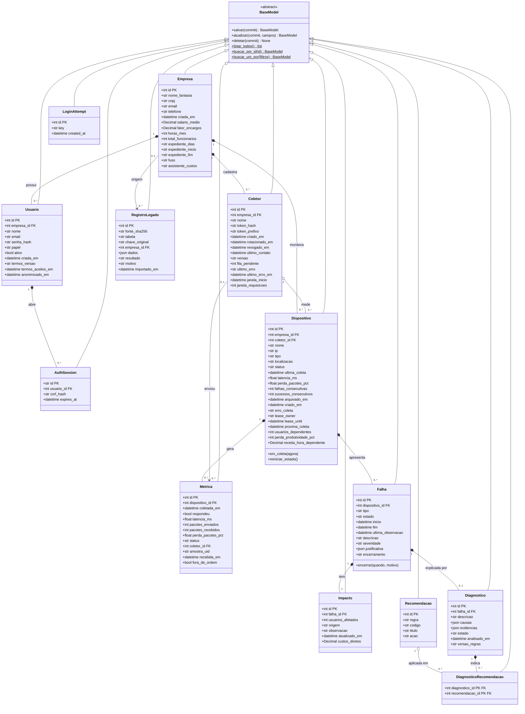

# Diagrama de classes do domínio

Gerado a partir dos Models reais em [`backend/models/`](../backend/models) por
[`docs/gerar_diagrama_classes.py`](gerar_diagrama_classes.py); `backend/tests/test_diagram.py` falha se o
diagrama ficar diferente do código. Imagem para slides: [`docs/img/diagrama-classes.svg`](img/diagrama-classes.svg)
([PNG](img/diagrama-classes.png)).

- **13 entidades**, todas herdando de `BaseModel` (`db.Model` do Flask-SQLAlchemy), que concentra o CRUD
  exigido pela disciplina: `salvar()`, `atualizar()`, `deletar()`, `listar_todos()` e `buscar_por_id()`
  (`$` = método de classe). Consultas especiais ficam na camada Repository.
- Atributos com o tipo do código (`Decimal` = valor monetário exato, `json` = coluna JSON). `PK` = chave primária,
  `FK` = chave estrangeira.

## Relacionamentos

Cardinalidade lida das chaves estrangeiras: `1` quando a FK é obrigatória, `0..1` quando aceita vazio, e `1 : 1` quando
a FK é única (`Impacto` e `Diagnostico` de uma `Falha`).

| Relação | Chave estrangeira | Tipo | Cardinalidade | Por quê |
|---|---|---|---|---|
| Usuario → AuthSession | `auth_sessions.usuario_id` | Composição | 1 : 0..* | sessão é apagada junto com o usuário (ON DELETE CASCADE) |
| Empresa → Coletor | `coletores.empresa_id` | Composição | 1 : 0..* | coletor pertence a uma única empresa |
| Diagnostico → DiagnosticoRecomendacao | `diagnostico_recomendacoes.diagnostico_id` | Composição | 1 : 0..* | vínculo apagado junto com o diagnóstico (CASCADE) |
| Recomendacao → DiagnosticoRecomendacao | `diagnostico_recomendacoes.recomendacao_id` | Agregação | 1 : 0..* | o catálogo de recomendações existe sem diagnósticos |
| Falha → Diagnostico | `diagnosticos.falha_id` | Composição | 1 : 0..1 | análise por regras da própria falha |
| Coletor → Dispositivo | `dispositivos.coletor_id` | Agregação | 0..1 : 0..* | o dispositivo existe sem coletor (worker local) e pode trocar de coletor |
| Empresa → Dispositivo | `dispositivos.empresa_id` | Composição | 1 : 0..* | inventário de uma única empresa |
| Dispositivo → Falha | `falhas.dispositivo_id` | Composição | 1 : 0..* | ocorrência é sempre de um dispositivo |
| Falha → Impacto | `impactos.falha_id` | Composição | 1 : 1 | criado junto com a falha (usuários afetados e custos diretos) |
| Coletor → Metrica | `metricas.coletor_id` | Associação | 0..1 : 0..* | apenas registra a origem da amostra (vazio = worker local) |
| Dispositivo → Metrica | `metricas.dispositivo_id` | Composição | 1 : 0..* | amostra só faz sentido para o dispositivo medido |
| Empresa → RegistroLegado | `registros_legados.empresa_id` | Associação | 0..1 : 0..* | registro importado do protótipo; a empresa pode não ter sido reconhecida |
| Empresa → Usuario | `usuarios.empresa_id` | Composição | 1 : 0..* | conta de usuário só existe dentro de uma empresa |

**Legenda:** composição (losango cheio, `*--`) = a parte não existe sem o todo; agregação (losango vazio, `o--`) = a parte
existe sozinha e só é agrupada; associação (`-->`) = apenas uma referência. `Diagnostico` × `Recomendacao` é
muitos-para-muitos por meio da classe associativa `DiagnosticoRecomendacao`. `LoginAttempt` não tem relacionamento:
guarda só o hash de IP + e-mail para limitar tentativas de login.
