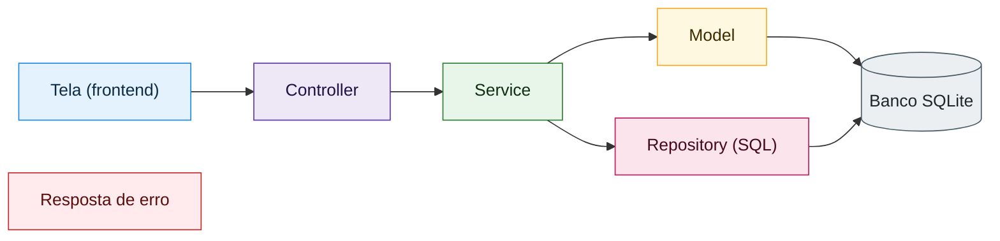
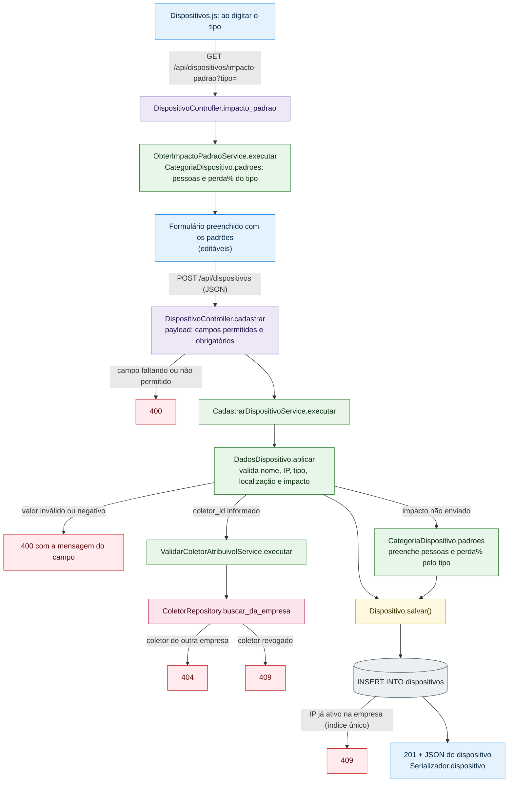
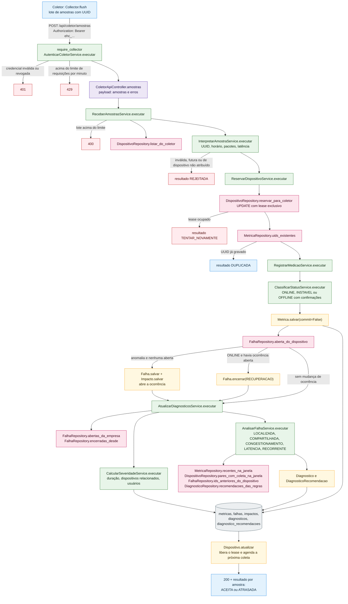
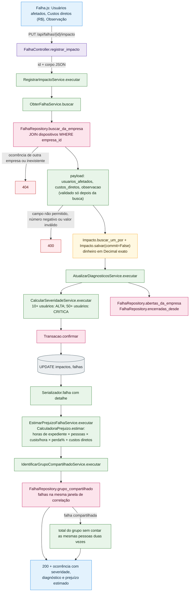
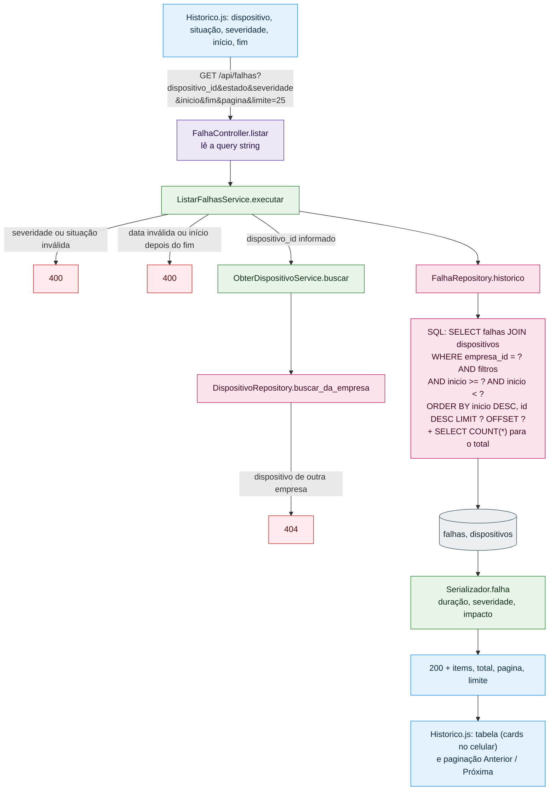
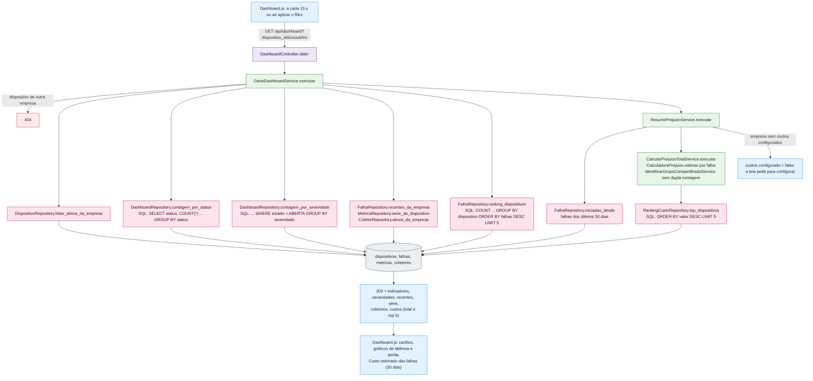
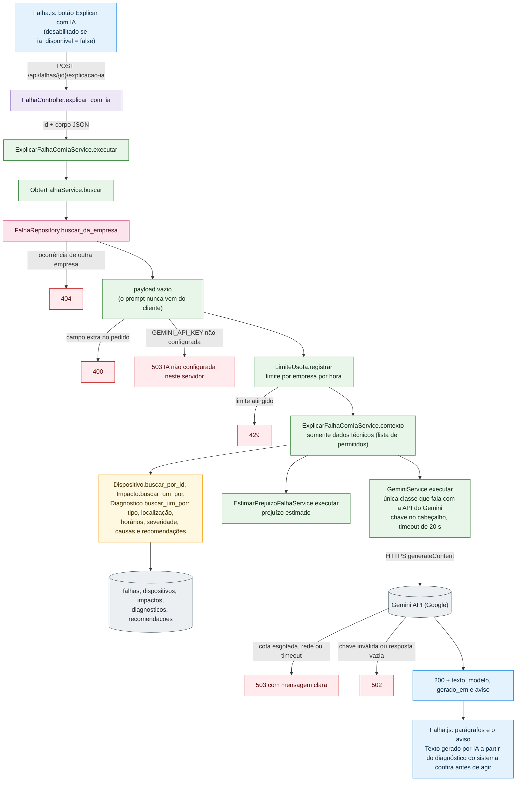

# Fluxogramas dos casos de uso

Seis casos de uso principais, passo a passo pelas camadas da API, com os **nomes reais** das classes e métodos
(`backend/tests/test_flowcharts.py` falha se algum Controller, Service ou Repository citado deixar de existir).
Imagens para slides em [`docs/img/`](img/).

Cada cor é uma camada:

Em todas as rotas com sessão, antes do Controller, o decorator `require_auth` (`backend/app/security.py`) chama o
`ValidarSessaoService`: sem sessão válida responde **401**; sem o token CSRF (em POST/PUT/DELETE) ou com os Termos de
Uso pendentes, **403**; rota de administrador para técnico, **403**. Toda busca por ID é limitada à empresa do usuário:
registro de outra empresa responde **404**, sem revelar que existe.

---

## 1. Entrada de dados: cadastrar dispositivo

**Objetivo:** incluir um equipamento no monitoramento, já com o impacto no negócio sugerido pelo tipo.
**Ator:** administrador ou técnico da empresa. **Tela:** `frontend/src/pages/Dispositivos.js` → "Cadastrar dispositivo".

Imagem para slides: [SVG](img/fluxo-1-cadastrar-dispositivo.svg) · [PNG](img/fluxo-1-cadastrar-dispositivo.png)

---

## 2. Entrada de dados: coletor envia amostras e o sistema detecta a falha

**Objetivo:** registrar as medições (ping) feitas dentro da rede do cliente e, a partir delas, abrir ou encerrar
ocorrências, diagnosticar e calcular a severidade. **Ator:** coletor remoto (`collector/edgehealth_collector.py` ou
`EdgeHealthColetor.exe`), autenticado por credencial própria. **Tela:** o resultado aparece na Visão da rede e no Histórico.

Imagem para slides: [SVG](img/fluxo-2-receber-amostras.svg) · [PNG](img/fluxo-2-receber-amostras.png)

O worker local do servidor usa o mesmo `RegistrarMedicaoService` (via `ColetarDispositivoService`), então as regras de
status, ocorrência, severidade e diagnóstico são uma só.

---

## 3. Entrada de dados: registrar o impacto de uma ocorrência

**Objetivo:** informar quantas pessoas foram afetadas e os custos diretos (técnico, peças, multas); a severidade e o
prejuízo estimado são recalculados na hora. **Ator:** administrador ou técnico. **Tela:**
`frontend/src/pages/Falha.js` → card "Impacto operacional".

Imagem para slides: [SVG](img/fluxo-3-registrar-impacto.svg) · [PNG](img/fluxo-3-registrar-impacto.png)

---

## 4. Recuperação de dados: histórico de falhas com filtros e paginação

**Objetivo:** investigar ocorrências abertas e encerradas por dispositivo, situação, severidade e período, inclusive de
dispositivos arquivados. **Ator:** administrador ou técnico. **Tela:** `frontend/src/pages/Historico.js` → "Filtrar".

Imagem para slides: [SVG](img/fluxo-4-historico-falhas.svg) · [PNG](img/fluxo-4-historico-falhas.png)

---

## 5. Recuperação de dados: visão da rede (dashboard)

**Objetivo:** mostrar o estado atual da rede, as ocorrências recentes, o desempenho no tempo e o custo estimado das
falhas dos últimos 30 dias com os 5 dispositivos que mais custaram. **Ator:** administrador ou técnico. **Tela:**
`frontend/src/pages/Dashboard.js` (atualiza sozinha a cada 15 s).

Imagem para slides: [SVG](img/fluxo-5-dashboard.svg) · [PNG](img/fluxo-5-dashboard.png)

---

## 6. Recuperação de dados com IA: explicar ocorrência com IA

**Objetivo:** gerar, em português simples para um gestor não técnico, o que aconteceu, o impacto provável e os
próximos passos, a partir do diagnóstico e das recomendações que o sistema já calculou. A IA **explica**; ela não
substitui nem altera o diagnóstico por regras. **Ator:** administrador ou técnico. **Tela:**
`frontend/src/pages/Falha.js` → card "Explicação com IA" → "Explicar com IA".

Imagem para slides: [SVG](img/fluxo-6-explicar-com-ia.svg) · [PNG](img/fluxo-6-explicar-com-ia.png)

